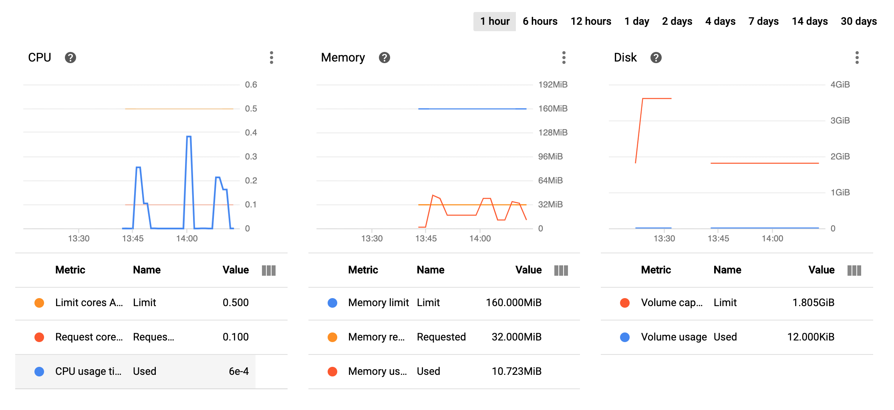

# Large file reader

- [Large file reader](#large-file-reader)
  * [Goal](#goal)
  * [Demo](#demo)
  * [Solution](#solution)
    + [Find example data](#find-example-data)
    + [First attempt](#first-attempt)
        * [concept](#concept)
        * [Result](#result)
    + [Second attempt](#second-attempt)
        * [Result](#result-1)
      - [Create larger text file](#create-larger-text-file)
      - [create cloud resources](#create-cloud-resources)
      - [Build container and deploy](#build-container-and-deploy)
      - [Get the IP address](#get-the-ip-address)
      - [Test the API](#test-the-api)
      - [Result](#result-2)
    + [Third attempt](#third-attempt)
      - [Result](#result-3)
  * [Conclusion](#conclusion)
  * [Clean up](#clean-up)

<small><i><a href='http://ecotrust-canada.github.io/markdown-toc/'>Table of contents generated with markdown-toc</a></i></small>


## Goal
- read 100 GB text file
- memory cap at 16 GB
- only scan text file once
- reduce IO operations
- find first unique word

## Demo
- it will take about 1 minute
- IP address and bucket URL will be remove afterward
```bash
curl 'http://34.87.25.50:3000/word?file=https://storage.googleapis.com/temp-read-large-file-bucket/big10.txt' | jq
```
## Solution
### Find example data

`emoji.txt` were combined from [Kaggle dataset](https://www.kaggle.com/praveengovi/emotions-dataset-for-nlp)

```bash
$ cat *.txt > emoji.txt # about 2.1 MB
``` 

### First attempt
With goroutines and `bufio.NewReader`
##### concept

1.  determine the filesize, and split into different goroutine, based on a constant `limitInBytes`
```go
goroutines := 1
limitInBytes := int64(*limit * kb)
if f.Size() > limitInBytes {
	goroutines = int(f.Size() / limitInBytes)
}
```

2. Define a channel to receive words
```go
channel := make(chan string)
dict := make(map[string]int)
done := make(chan bool, 1)
words := 0
go func() {
	for s := range channel {
		words++
		dict[s]++
	}
    done <- true
}()

```

3.  Read the file from specific destination
```go
// offset is the last reading position
file.Seek(offset, 0)
reader := bufio.NewReader(file)
// if current cummulativeSize is larger than the limit 
// that supposed to read by this goroutine, exit the function
if cummulativeSize > limit {
	break
}
// read word by word
b, err := reader.ReadBytes(' ')
// send to the word channel
channel <- s

```
4. Read the file on each goroutine
```go
for i := 0; i < goroutines; i++ {
	wg.Add(1)

	go func() {
      // file reading
	  read(current, limitInBytes, *file, channel)
	  wg.Done()
	}()

	current += limitInBytes + 1
}
```

5. Wait the goroutines to finish
```go
wg.Wait()
close(channel)

// to exit the word channel
<-done
close(done)
```
##### Result
faster, lower memory usage, but not accurate (could be some logic error)
```bash
$ go run cmd/reader.go

4 goroutine has been completed
4 goroutine has been completed
4 goroutine has been completed
4 goroutine has been completed
Alloc = 2 MiB	TotalAlloc = 2 MiB	Sys = 69 MiB	NumGC = 0
emoji.txt is 2069616 bytes
uniqueWords: 10929, wordCount: 101011
time taken: 52.895164ms
top 5 words

i, 4124
feel, 3859
and, 3292
to, 3097
the, 2848
a, 2163
```

### Second attempt
With `bufio.NewScanner` and  `Scan()`
```go
func readFile(f *os.File) (map[string]int, int) {
	dict := make(map[string]int)
	words := 0

	scanner := bufio.NewScanner(f)
	for scanner.Scan() {
		for _, w := range strings.Fields(scanner.Text()) {
			dict[w]++
			words++
		}
	}
    return dict, words
}
```
##### Result
- slower, higher memory usage, accurate
- Not sure if this can handle large files, without hitting ouf of memory error, will test it out in the below section. 
```bash
$ go run cmd/scanner.go

Alloc = 4 MiB	TotalAlloc = 10 MiB	Sys = 71 MiB	NumGC = 3
emoji.txt is 2069616 bytes
uniqueWords: 23929, wordCount: 382701
time taken: 35.120529ms
top 5 words

i, 32221
feel, 13938
and, 11983
to, 11151
the, 10454
a, 7732
```

Looks like second approach is better. Not sure if will hit out of memory error. Let's improve second approach further. To simulate low memory environment, we containerise it, wrap it on http server and run on Kubernetes.

```go
http.HandleFunc("/word", readFileHandler)
http.ListenAndServe(":3000", nil)
```

Run locally
```bash
go run cmd/server.go
```

The Web API will look like this
```text
http://IP_ADDRESS/word?file=file-url.txt
```

Assume we need to read 100 GB file, with max 16 GB memory. 
then we can simulate by reading 1 GB file, with max 0.16 GB (160 MB) memory.

| File size (GB) | Max Memory (GB)   
| :------------- | :----------: | 
|  100           | 16           | 
| 1              | 0.16         |

If the usage exceed 160 MB, the pod will be killed, by providing value to `spec.containers[].resources.limits.memory`

```yaml
 resources:
    requests:
      memory: "32Mi"
      cpu: "100m"
    limits:
      memory: "160Mi"
      cpu: "500m"
```

#### Create larger text file
```bash
$ cat /usr/share/dict/words | sort -R | head -100000 > file.txt
$ cat *.txt > big.txt # repeat for 10 times until get 1.6GB txt file
```

#### create cloud resources
- create public bucket
- upload `big10.txt` to bucket
- create GKE cluster
> make sure to download Service Account file with appropriate permissions from cloud console
```bash
$ cd terraform
$ terraform init
$ terraform apply
```

#### Build container and deploy
> make sure you enable cloud build access to GKE at [setting](https://console.cloud.google.com/cloud-build/settings/service-account)
```bash
$ gcloud builds submit . \
   --substitutions SHORT_SHA=$(git rev-parse --short HEAD)
```

#### Get the IP address
> can get from cloud console or CLI
```bash
$ gcloud container clusters get-credentials CLUSTER_NAME --zone ZONE --project PROJECT_ID
$ kubectl get service
NAME                  TYPE           CLUSTER-IP   EXTERNAL-IP   PORT(S)          AGE
file-reader-service   LoadBalancer   10.3.254.7   34.87.25.50   3000:31465/TCP   24m
```

#### Test the API
```bash
$ curl 'http://IP_ADDRESS/word?file=https://big10.txt' | jq

  % Total    % Received % Xferd  Average Speed   Time    Time     Time  Current
                                 Dload  Upload   Total   Spent    Left  Speed
100   402  100   402    0     0      4      0  0:01:40  0:01:36  0:00:04   104
{
  "file": {
    "MiB": 1526,
    "name": "file-1601703943.txt",
    "size": 1600501760,
    "url": "https://big10.txt"
  },
  "mem": {
    "alloc": "22 MiB",
    "numGC": "506",
    "sys": "71 MiB",
    "totalAlloc": "5562 MiB"
  },
  "timeTaken": "1m15.587011379s",
  "words": {
    "firstUniqueWord": "yaguaza",
    "top5": [
      "i, 16497152",
      "feel, 7136768",
      "and, 6135296",
      "to, 5709312",
      "the, 5352960",
      "a, 3958784"
    ],
    "uniqueWords": 119960,
    "wordCount": 247142912
  }
}
```
Pod usage metrics
> After hit the API for 3 times, rest in between, to show cool down period

> Memory: Max usage:44.4 MiB during file processing



#### Result
Based on the result, it can read 1.5-1.6 GB of text file with ~ 40 MB memory. The pod did not get killed due to `OOMKilled` error. Thus, we can assume that it can handle 100 GB text file with cap memory at 16 GB.

Also, found the first unique word by reading the file only once and other additional information. 


### Third attempt
On this attempt, I will try to mimic Hadoop Map Reduce concept. Instead of using HDFS, we just write to local file storage.

1. Set a `lineLimit`, and read the files based on line limit, if current read line more than `lineLimit`, send a Mapper job
2. Mapper will process, count unique words, and  write result to file
3. Once all Mapper jobs are complete, Reducer will trigger.
4. Reducer will read all files written by Mapper, and combine the results

```go
// read line by line
for scanner.Scan() {
	accLines += fmt.Sprintf("\n%s", scanner.Text())
	counter++
	if counter > lineLimit {
		wg.Add(1)
        // trigger Mapper Job
		go mapper(&wg, accLines, dirPath)
		// reset
		accLines = ""
		counter = 0
	}
}
// wait for all Mapper jobs completes
wg.Wait()

// trigger Reducer
res, reducerFile := reducer(dirPath)
```

#### Result

```bash
$ go run fake-hadoop.go
Result written to tmp/reducer-1602762922444809000.json
First unique word: interdum
top 5 words

sed, 20
non, 12
sit, 12
et, 12
ipsum, 10
purus, 9

$ cat tmp/reducer-16027x62922444809000.json
{
 "Aenean": 6,
 "Aliquam": 2,
 "Cras": 3,
 "Curabitur": 1,
 "Donec": 6,
 "Duis": 3,
 "Etiam": 1,
 "Fusce": 2,
  .....
}
```
This approach does lower the usage of memory, but has high IO operation.

## Conclusion
I am not exact sure if [second approach](#second-attempt) will not get `out of memory`, thus I test it by simulating low memory environment, with the ratio below. 

| File size (GB) | Max Memory (GB)   
| :------------- | :----------: | 
|  100           | 16           | 
| 1              | 0.16         |

With the test result shown, I guess it will not get `out of memory`. If you have any suggestions and approaches, please let me know! I am keen to learn about it.

For the [third approach](#third-attempt), I personally is not a good choice. IO operation is slow. Which is why Spark RDD was created. 

> Spark has been found to run 100 times faster in-memory, and 10 times faster on disk. It’s also been used to sort 100 TB of data 3 times faster than Hadoop MapReduce on one-tenth of the machines. 


Let me know what you think. I am happy to know. 

Thanks!

## Clean up 

```
cd terraform
terraform destroy
```
